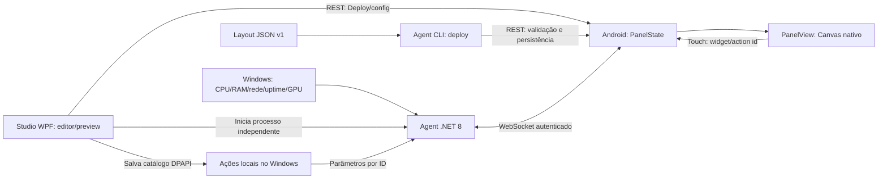

# Arquitetura

LegacyDisplay separa configuração, coleta e apresentação. O tablet é uma interface genérica; ids de fontes e ações são opacos para ele. Não há dependência de mineração, modelo de GPU ou Home Assistant no renderer.

## Android

`PanelApplication` carrega o layout local ou o fallback dos assets e inicia `PanelServer` uma vez por processo. Activity e mudanças de orientação compartilham esse runtime. `MainActivity` aplica fullscreen, orientação e opção de tela ligada. `BootReceiver` abre a Activity após boot no Android 7 quando habilitado.

`PanelState` faz validação, persistência síncrona antes da troca de estado, snapshots de fontes e correlação de ações. `PreferencesStorage` usa SharedPreferences privadas, com `commit` e verificação de falha. Os listeners encaminham invalidações para a main thread; I/O de ações/configuração fica em executor separado. Layout inválido nunca substitui um layout válido. Dados corruptos ao iniciar usam o dashboard padrão.

`PanelView` desenha o espaço lógico do JSON com Canvas. A escala proporcional também é invertida no hit test. Apenas alterações de dados/layout/touch invalidam a UI; não existe renderização contínua a 60 FPS. Ainda é necessário medir RAM, tempo de frame e resposta ao toque no Tab E.

`PanelServer` usa NanoHTTPD/NanoWSD. Bearer é validado antes do upgrade. O código de pareamento é gerado criptograficamente, exibido apenas localmente e tem expiração/limite de tentativas. Um único Agent pode estar conectado. Revogar o token desconecta a sessão.

## Windows

`LegacyDisplay.Protocol` é uma biblioteca .NET 8 com os modelos e regras de validação. `LegacyDisplay.Agent` é um executável de console independente de qualquer editor. O Agent coleta informações usando APIs Windows e interfaces de rede do .NET, abre a sessão do tablet e transmite amostras. A recepção de ações e o envio de métricas são concorrentes, com exclusão entre envios WebSocket.

O runtime confere UUID, botão e ID da ação antes de usar o catálogo local protegido por DPAPI. `ActionExecutor` executa HTTP, aplicativos, sequências e funções registradas em C#, além de `demo.ping`. Nenhum campo JSON é interpretado como código C#. O catálogo é validado e relido a cada toque; arquivos inválidos falham sem reutilizar permissões antigas. As ações têm exclusão mútua, limite cooperativo de oito segundos e não são repetidas após perda da sessão. A recepção continua atendendo heartbeats e alterações de layout enquanto aguarda HTTP. Os últimos 128 UUIDs de cada sessão são retidos para rejeitar solicitações repetidas.

GPU real vem de LibreHardwareMonitor 0.9.6 com apenas a categoria GPU habilitada; o driver é consultado no máximo uma vez por segundo. Falhas geram valores null para sensores conhecidos. GPU fictícia só existe com `--demo` e usa o prefixo `demo`. Adaptadores REST para fontes de dados continuam futuros.

`LegacyDisplay.Windows` reúne DeviceClient/credenciais, métricas, catálogo/executor de ações, USB/ADB e lançamento do processo Agent; ambos os executáveis compartilham os arquivos DPAPI. `LegacyDisplay.Studio.Core` mantém documentos validados, histórico limitado a 100 etapas, gestos atômicos e gravação por arquivo temporário/rename.

`LegacyDisplay.Studio` usa WPF, Canvas/Thumb, painel de propriedades, lista de fontes e Deploy. A coleta de preview roda fora da thread de UI. A edição é local até Deploy. Uma leitura assíncrona do tablet não substitui alterações feitas durante a requisição. Status é consultado periodicamente por HTTP; o Studio não disputa o único WebSocket do Agent.

O Agent lançado pelo Studio é um processo sem console e continua ao fechar o editor. A retomada valida PID, instante de início e caminho do executável antes de permitir parada. Nenhum processo iniciado por outro terminal é encerrado pelo Studio.

## Decisões e limites

- Android mínimo 7.0/API 24; compile/target 35. Início no boot e kiosk estão implementados para Android 7, sem assumir suporte às restrições de Activity em versões modernas.
- Armazenamento local, funcionamento offline e nenhuma conta/serviço Google.
- Sem Compose, Flutter, framework web, scripts, cloud ou MQTT.
- Wi-Fi por URL. USB pode ser configurado pelo Studio via ADB forwarding para um único dispositivo autorizado; ainda sem fallback automático para LAN.
- Atualizações em 1–10 Hz conforme necessidade; temperaturas não precisam de refresh de vídeo.
- Serviço Windows, tray, descoberta LAN e lock task/device owner são etapas posteriores.
- O transporte HTTP/WS e os limites de alocação do NanoWSD são restrições do PoC; ver o contrato para os requisitos de endurecimento.

## Referências de build

Versões fixas evitam depender do que houver de mais recente: AGP 8.9.2, Gradle 8.11.1, Kotlin 2.1.20, .NET 8. O [AGP 8.9 documenta Gradle 8.11.1 e JDK 17](https://developer.android.com/build/releases/agp-8-9-0-release-notes); JDK 21 foi usado neste ambiente. O [NanoHTTPD](https://github.com/NanoHttpd/nanohttpd) fornece o servidor leve, com as limitações registradas em `protocol/PROTOCOL.md`.
